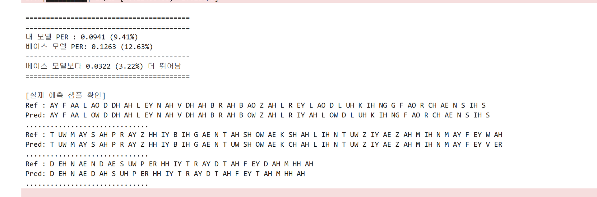

# Wav2Vec2 기반 L2-Arctic 음소 단위 발음 오류 검출 Fine-Tuning

## 왜 파인튜닝이 필요하였나요?
본 서비스는 청각장애인을 위한 영어 발음 교정 서비스를 목표로 기획되었습니다.   

청각장애인 사용자의 경우, 청각적 피드백에 의존한 교정 방식은 한계가 있습니다. 발음 평가에서 중요한 것은 단어의 정답 여부가 아니라, 개별 음소가 얼마나 정확하게 조음되었는지입니다. 실제로 발음 평가 관련 연구에서도 단어 단위 인식보다 음소 단위의 정밀한 인식이 발음 오류 분석에 더 적합하다고 보고하고 있습니다.   
이에 따라 본 프로젝트는 단어 단위 복원을 목표로 하는 일반 ASR 접근 대신,
음소(phoneme) 단위 인식을 수행하는 모델이 필수적이라고 판단하여 음소 단위 발음 오류 검출에 적합한 모델로 wav2vec2 모델을 파인튜닝하였습니다.   

---

### 기존 ASR 모델의 한계
Whisper와 같은 일반 음성 인식 모델은 본질적으로 **어휘 사전에 정의된 단어 열을 복원하는 것**을 목표로 하고 있습니다.

즉, 발음이 다소 부정확하더라도 문맥을 기반으로 가장 그럴듯한 단어로 보정하여 출력하는 경향이 있습니다.

```
# 예시
Input 발음: "opple"
Output: "apple"
```

이러한 경우 실제 발음 오류는 감춰지게 되며, 발음 교정 서비스에서는 치명적인 한계로써 작용하게 됩니다.
---

### 연구적 근거

본 프로젝트는 다음 연구의 문제의식에 기반하였습니다:

> Whisper와 같이 음성 인식을 목적으로 개발된 모델의 경우 인식 결과가 발음 표기가 아닌 어휘 사전에 정의된 단어 열로 출력되는 경향이 있다.   
>  -「비원어민 한국어 발음 평가를 위한 자기 지도 학습 기반 한국어 음소」 인식

해당 연구에서는 단어 복원 중심 ASR이 아닌, **음소 단위 인식 기반 평가 접근**이 발음 오류 검출에 적합하다고 제시하고 있습니다.

이와 동일한 관점에서, 바르미 프로젝트는 영어 발음 교정을 위해:
+ 단어 단위 ASR 대신
+ 음소 단위 CTC 인식 모델을 직접 구축하고
+ 수동 주석이 포함된 L2-Arctic 데이터셋을 활용하여 파인튜닝하였습니다.

### 핵심 차별점

| 일반 ASR      | 본 프로젝트      |
| ----------- | ----------- |
| 단어 복원 중심    | 음소 인식 중심    |
| 문맥 보정       | 실제 발음 반영    |
| 발음 오류 은폐 가능 | 발음 오류 직접 검출 |

---

## 파인튜닝 과정

1. L2-Arctic 수동 음소 주석(annotation) 사용
2. Custom phoneme vocabulary 구성
3. Wav2Vec2 CTC 기반 음소 단위 fine-tuning
4. PER(Phoneme Error Rate) 기반 평가
---

### 데이터 
#### L2-Arctic Dataset 구조

```
/wav          : 44.1kHz WAV 파일
/transcript   : 정서적 전사 (TXT)
/textgrid     : forced-alignment 기반 음소 전사
/annotation   : 수동(manual) 음소 주석 (TextGrid)
```

> 본 프로젝트에서는 **수동 주석이 포함된 `/annotation`만 사용**하였습니다.

---

### 데이터 전처리

#### 1️. 음성 필터링

+ 20초 초과 음성 제거 (학습 안정성 확보)

#### 2️. TextGrid 파싱

* `phones` tier에서 학습자 발음(ppl)만 추출
* `cpl`(canonical) 대신 실제 발음(`ppl`) 사용

#### 3️. 음소 정제

* 대문자 통일
* 숫자(stress marker) 제거
* 특수문자 제거
* `ERR → ER` 보정
* 무음 토큰(`SP, PAU, SIL, SPN`) → `SIL` 통일

#### 4️. 최종 데이터 구조

```python
{
  "wav": wav_path,
  "duration": float,
  "speaker": speaker_id,
  "ppl": "AH N D ER ..."
}
```

---

### 토크나이저

* 데이터셋에서 등장하는 모든 음소 수집
* `[PAD]=0`, `[UNK]=1`, `|=2`
* 실제 음소는 index 3부터 할당
* `vocab.json`으로 저장하여 재현성 확보

---

### Model Architecture

Base Model: `facebook/wav2vec2-base-960h`

전략:

+ CTC 기반 음소 단위 학습
+ Custom vocab 적용
+ feature encoder 동결
+ gradient checkpointing 활성화

---

### 학습 과정

#### 1차 학습

* LR: 3e-5
* Scheduler: linear
* Warmup: 500 steps
* Batch size: 8 (×4 accumulation → effective 32)
* FP16 mixed precision
* SpecAugment (light)

  * mask_time_prob=0.05
  * layerdrop=0.05
* PER 기준 Best model 저장

---

#### 2차 추가 학습 

Best checkpoint 로드 후:

* SpecAugment 강화
  * mask_time_prob=0.08
  * mask_feature_prob=0.02
  * layerdrop=0.1
* LR: 5e-5
* Scheduler: cosine
* Weight decay: 0.005
* EarlyStopping (patience=5)

목적:

> 과적합을 줄이고 일반화 성능 향상

---

### 평가 지표

+ CER metric을 활용하여 **Phoneme Error Rate (PER)** 계산
+ CTC 중복 토큰 제거 후 비교
+ `[PAD]`, `[UNK]`, `|` 토큰 제거 후 평가

---

### Data Collator

* 입력 오디오와 라벨을 각각 padding
* padding된 라벨은 `-100`으로 마스킹
* CTC loss에서 padding 무시

## 파인튜닝 결과

파인튜닝 결과 베이스 모델인 wav2vec2 모델보다 3.22% 향상된 모델을 성공적으로 얻을 수 있었습니다.   
해당 파인튜닝 모델은 [wishkim/wav2vec2-l2arctic-phoneme](https://huggingface.co/wishkim/wav2vec2-l2arctic-phoneme)에서 사용할 수 있습니다.

-----------------------------------------------------
### 코드리뷰
- [[1차] Intonation Model Review](https://www.notion.so/1-Intonation-Model-Review-2eefc74069a68043bba5f0e04e8bb209?source=copy_link)
- [[1차] IPA Model Review](https://www.notion.so/1-2f0fc74069a6806db6e5dbcf09428284?source=copy_link)